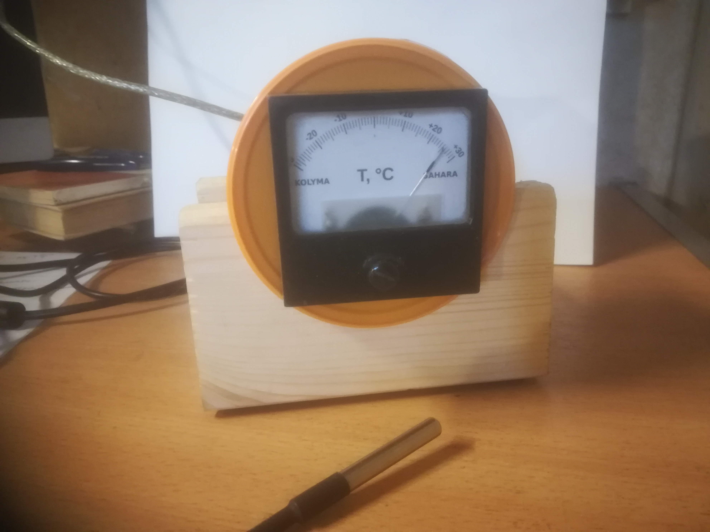
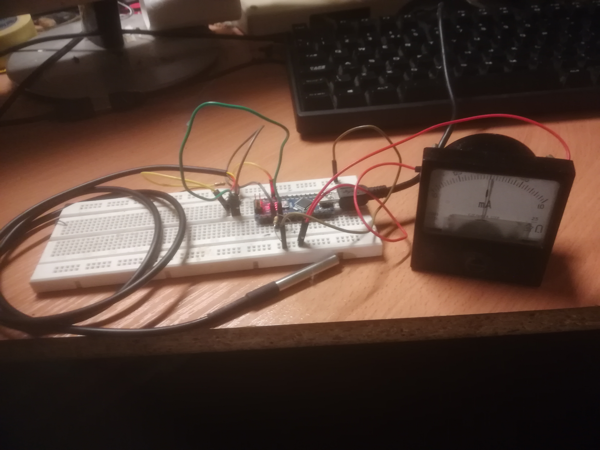
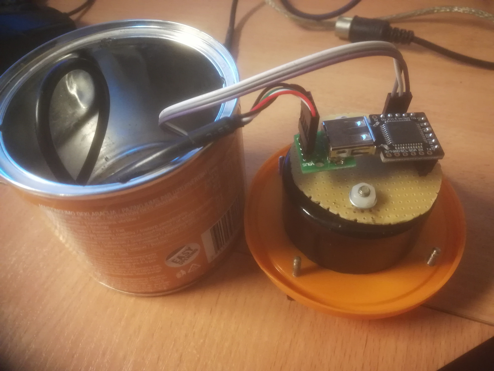
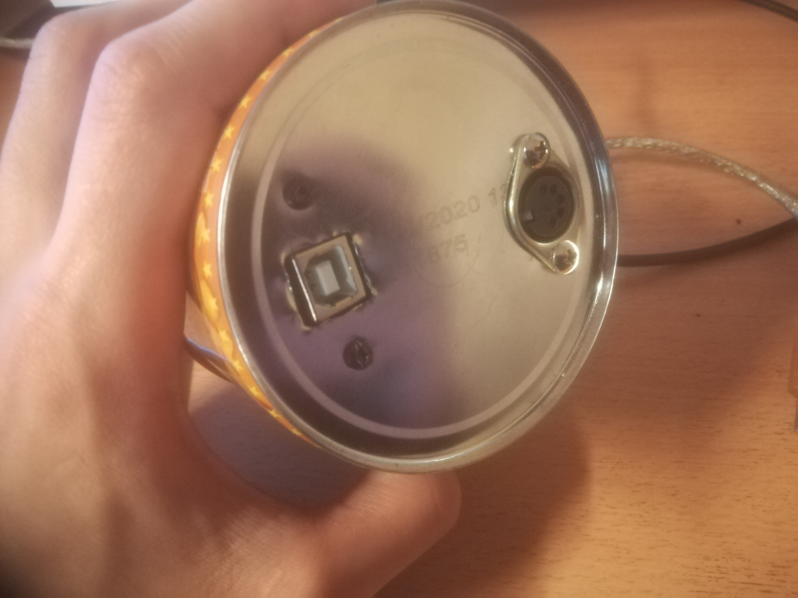
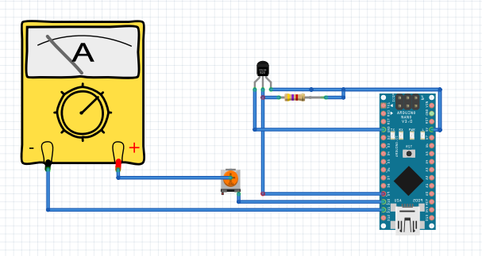
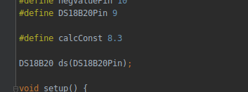

# DS18B20-Thermometer
DS18B20 Thermometer with ammeter as temperature indicator.

 <!-- .element height="50%" width="50%" -->

### Summary:

1. [Description](#description)
2. [Hardware module schematic](#hardware-module-schematic)
3. [Setting up IDE and flashing firmware](#setting-up-ide-and-flashing-firmware)

------------------------------------------------------------------------------------------------------------------
### Description:

This device shows temperature in Celsius.
 
- Minimal temperature is -30 °C
- Maximal temperature is +30 °C
- Power voltage : 5V

Device consists from the following parts:
- DS18B20 digital thermometer
- Arduino Beetle board
- m2001 soviet ammeter (±1ma)
- 4.7 kOhm resistor for DS18b20
- Precision 10kOhm potentiometer for ammeter (to reduce current)
- DIN5 connectors for thermometer
- USB connector for mcu board
- Power supply (5v 500ma)
- Estrella honey nuts can :) 

More photos [here][photos]

[Back](#summary)

------------------------------------------------------------------------------------------------------------------
### Hardware module schematic

Few photos:

 <!-- .element height="50%" width="50%" -->

 <!-- .element height="50%" width="50%" -->

 <!-- .element height="50%" width="50%" -->

#### Gauges:

The gauge for panel meter is [here][photos]. 

When You will print them, set scale to 103%. The gauges were drawn in [Scale Master][scale_master] and exported as PNG with 600 dpi quality.

Circuit diagram:

 <!-- .element height="50%" width="50%" -->

[Back](#summary)

------------------------------------------------------------------------------------------------------------------
### Setting up IDE and flashing firmware:

To flash the software You will need to set board in Arduino IDE. In out case You shout set ```Arduino Leonardo```.

Also there is a constant value in code, named `calcConst`:

 <!-- .element height="50%" width="50%" -->

It is needed to use all gauge of the meter. If You will use another type of meter, You should adjust this value.

And don't forget to download DS18B20 library in Your Arduino IDE. I used `DS18B20` library by Mathias Munk Hansen.
More info about it [here][ds18b20]. 
 
[Back](#summary)

------------------------------------------------------------------------------------------------------------------

   [photos]: <https://github.com/nislamovs/DS18B20-Thermometer/tree/master/docs/photos/>
   [gauge]: <https://github.com/nislamovs/DS18B20-Thermometer/blob/master/docs/Front_panel_image.png>
   [ds18b20]: <https://github.com/matmunk/DS18B20>
   [scale_master]: <https://soulmare.github.io/scale_master/#>
   